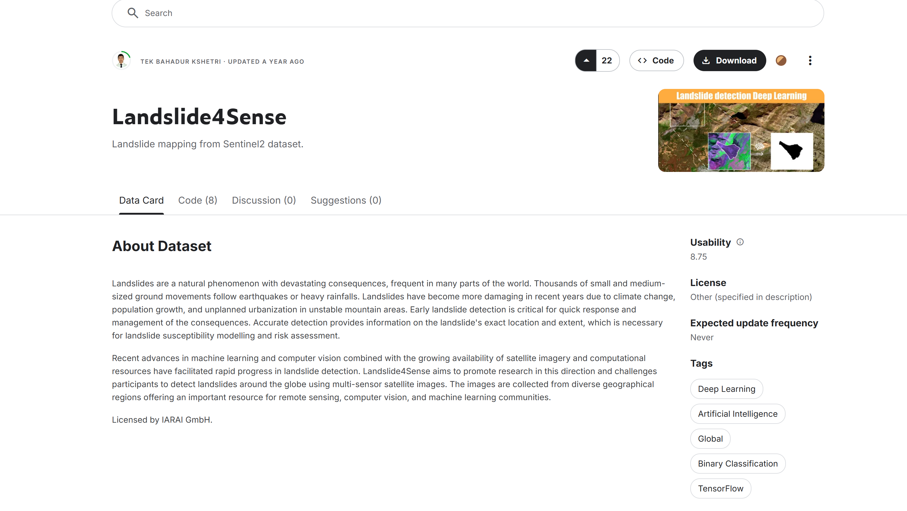
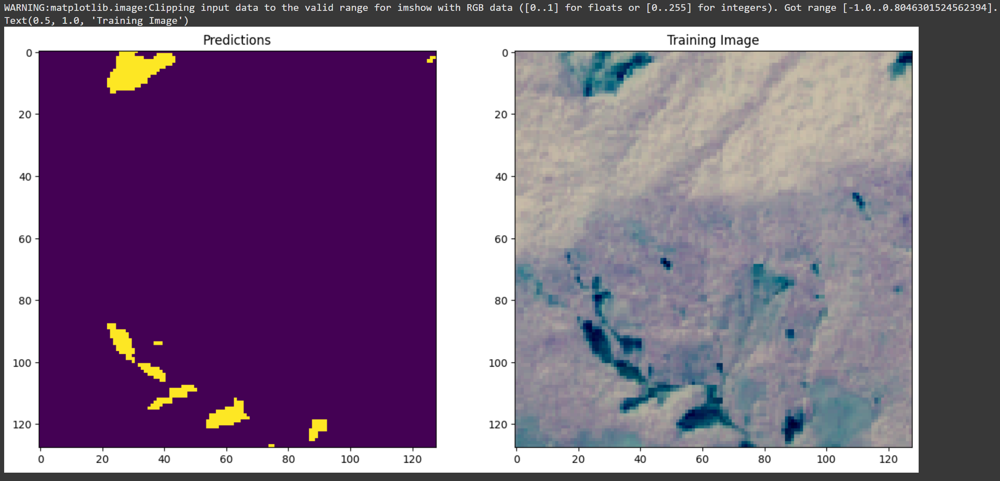
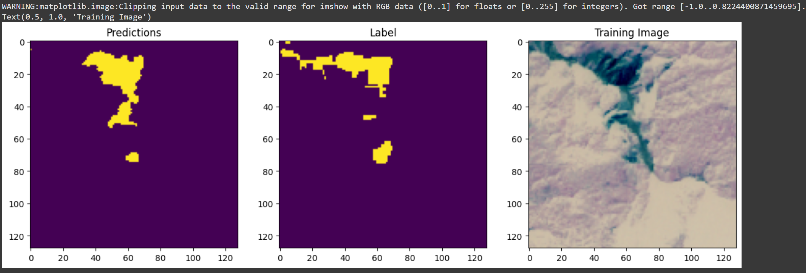

# UNet-SlipSentinel
A hands-on tutorial on landslide segmentation using U-Net and HDF5 satellite data. It covers preprocessing multi-band imagery, computing NDVI, and training a U-Net model in TensorFlow. Ideal for geospatial and civil engineering tasks, with clear visuals and Colab support for easy experimentation.

## Credits
This project is based on the original work by [Tek Bahadur Kshetri](https://github.com/iamtekson/landslide4sense-solution). I undertook this project as part of my Environmental Informatics Assignment to learn semantic segmentation using transfer learning. The dataset used in this project can be downloaded from [Kaggle](https://www.kaggle.com/datasets/tekbahadurkshetri/landslide4sense/data).


## Running Locally
To run this program locally, follow these steps:

1. Clone this repository:
    ```bash
    git clone https://github.com/ShishirBro/UNet-SlipSentinel.git
    ```

2. Navigate to the repository directory:
    ```bash
    cd UNet-SlipSentinel
    ```

3. Install the required environment using `landslide_det.yaml`:
    ```bash
    conda env create -f landslide_det.yaml
    ```

4. Activate the environment:
    ```bash
    conda activate landslide_det
    ```

5. Run the Jupyter Notebook:
    ```bash
    jupyter notebook Landslide_det_Unet.ipynb
    ```

**Note:** This code is computationally intensive. If CUDA is not installed, it may be very heavy on your system.

## Running on Google Colab
You can also reproduce the results using Google Colab. Follow these instructions:

1. Clone the repository:
    ```python
    !git clone https://github.com/ShishirBro/UNet-SlipSentinel.git
    ```

2. Navigate to the repository directory:
    ```python
    %cd UNet-SlipSentinel
    ```

3. Run the notebook:
    ```python
    %run /content/UNet-SlipSentinel/Landlide_det_Unet.ipynb
    ```

## Results
The results of the segmentation process look like this:



